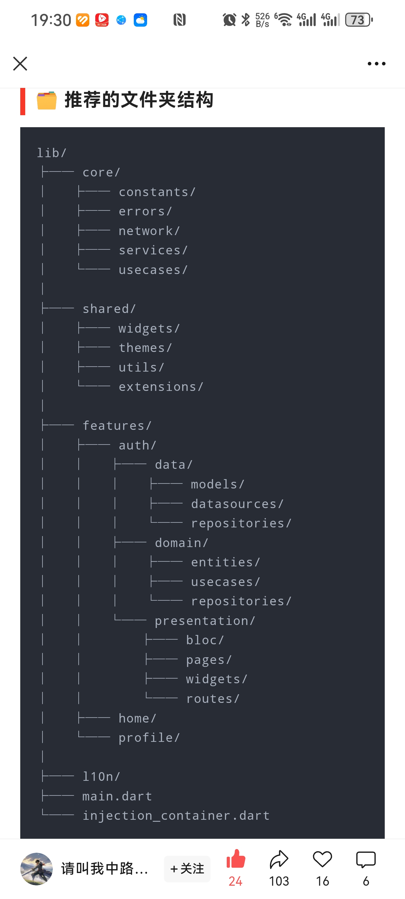

# wanandroid_app_flutter_riverpod

基于[玩Android API](https://www.wanandroid.com/) 的 Flutter 客户端，采用 Clean Architecture 架构设计，使用 Riverpod 进行状态管理。

## 功能特性

| 模块 | 功能说明 |
|------|----------|
| 首页 | Banner 轮播、置顶文章、文章列表分页加载 |
| 体系 | 知识体系分类浏览、按分类查看文章 |
| 导航 | 常用网站导航、快捷跳转 |
| 项目 | 开源项目分类、项目列表浏览 |
| 登录/注册 | 用户认证、登录状态管理 |
| 收藏 | 文章收藏、收藏列表管理 |
| 设置 | 主题切换（明/暗）、应用设置 |
| 日志 | 应用日志系统、日志查看与管理 |

## 技术栈

### 核心框架
| 技术 | 版本 | 说明 |
|------|------|------|
| Flutter | ^3.8.0 | 跨平台 UI 框架 |
| Dart | ^3.8.0 | 编程语言 |

### 主要依赖
| 依赖 | 版本 | 说明 |
|------|------|------|
| flutter_riverpod | ^3.0.3 | 状态管理 |
| riverpod_annotation | ^3.0.3 | Riverpod 代码生成 |
| go_router | ^15.0.0 | 声明式路由 |
| dio | ^5.9.0 | 网络请求 |
| freezed | ^3.2.3 | 不可变数据类 |
| json_annotation | ^4.9.0 | JSON 序列化 |
| flex_color_scheme | ^8.3.0 | Material Design 3 主题 |
| flutter_rust_bridge | ^2.11.1 | Flutter 与 Rust 跨语言集成 |
| webview_flutter | ^4.13.0 | WebView 组件 |
| hive | ^2.2.3 | 本地数据库 |
| shared_preferences | ^2.5.3 | 本地存储 |
| flutter_screenutil | ^5.9.3 | 屏幕适配 |
| cached_network_image | ^3.4.1 | 图片缓存 |
| rive | ^0.13.20 | 矢量动画 |
| sherpa_onnx | ^1.12.32 | 本地机器学习推理 |

## 项目结构

```
lib/
├── main.dart                    # 应用入口
├── app.dart                     # App 配置
├── bootstrap.dart               # 启动引导
├── common/                      # 公共模块
│   └── router/                  # 路由配置
├── core/                        # 核心层
│   ├── constants/               # 常量定义
│   └── services/                # 核心服务
│       └── storage/             # 存储服务
├── features/                    # 功能模块（Feature-First）
│   ├── article/                 # 文章模块
│   │   ├── domain/              # 领域层
│   │   │   ├── entities/        # 实体
│   │   │   └── repositories/    # 仓库接口
│   │   ├── infrastructure/      # 基础设施层
│   │   │   └── repositories/    # 仓库实现
│   │   └── presentation/        # 表现层
│   │       ├── providers/       # 状态管理
│   │       └── screens/         # 页面
│   ├── banner/                  # Banner 模块
│   ├── home/                    # 首页模块
│   ├── logger/                  # 日志模块
│   ├── main_wrapper/            # 主框架（底部导航）
│   ├── navi/                    # 导航模块
│   ├── profile/                 # 个人中心
│   ├── question_and_answers/    # 问答模块
│   ├── setting/                 # 设置模块
│   ├── sign_in/                 # 登录
│   ├── sign_up/                 # 注册
│   └── welcome/                 # 欢迎页
├── model/                       # 数据模型
│   ├── architecture/            # 架构相关模型
│   ├── hotkey/                  # 热词模型
│   └── navi/                    # 导航模型
├── shared/                      # 共享模块
│   ├── theme/                   # 主题配置
│   ├── utils/                   # 工具类
│   └── widgets/                 # 公共组件
│       └── webview_page.dart    # WebView 页面
└── src/rust/                    # Rust FFI 生成代码
```

### 架构说明

本项目采用 **Clean Architecture** 分层架构：

- **Presentation Layer（表现层）**: UI 组件、页面、状态管理（Provider）
- **Domain Layer（领域层）**: 业务实体、仓库接口定义
- **Infrastructure Layer（基础设施层）**: 仓库实现、数据源、外部服务

## 开始使用

### 环境要求

- Flutter SDK ^3.8.0
- Dart SDK ^3.8.0
- Android Studio / VS Code
- Xcode（iOS 开发）
- Rust 环境（如需使用 flutter_rust_bridge）

### 安装步骤

1. **克隆项目**
   ```bash
   git clone <repository-url>
   cd wanandroid_app_flutter_riverpod
   ```

2. **安装依赖**
   ```bash
   flutter pub get
   ```

3. **生成代码**（Riverpod、Freezed、JSON 序列化）
   ```bash
   dart run build_runner build --delete-conflicting-outputs
   ```

4. **运行项目**
   ```bash
   flutter run
   ```

## 开发命令

### 代码生成

```bash
# 单次生成
dart run build_runner build

# 监听模式（开发时推荐）
dart run build_runner watch

# 清理并重新生成
dart run build_runner build --delete-conflicting-outputs
```

### Rust FFI 生成

```bash
# 生成 Rust绑定
flutter_rust_bridge_codegen generate

# 监听模式
flutter_rust_bridge_codegen generate --watch
```

### 代码格式化

```bash
dart format .
```

### 依赖管理

```bash
# 查看过时依赖
flutter pub outdated

# 降级依赖（如需回退）
flutter pub downgrade
```

### 打包发布

```bash
# Android APK（按架构分包）
flutter build apk --release --target-platform android-arm,android-arm64,android-x64 --split-per-abi

# Android App Bundle
flutter build appbundle --release

# iOS
flutter build ios --release
```

## API 来源

本项目使用[玩Android](https://www.wanandroid.com/) 开放 API，感谢鸿洋大神提供的接口服务。

主要 API 接口：

| 接口 | 说明 |
|------|------|
| `/banner/json` | 首页 Banner |
| `/article/list/{page}/json` | 文章列表 |
| `/article/top/json` | 置顶文章 |
| `/tree/json` | 知识体系 |
| `/navi/json` | 导航数据 |
| `/project/tree/json` | 项目分类 |
| `/user/login` | 登录 |
| `/user/register` | 注册 |
| `/lg/collect/list/{page}/json` | 收藏列表 |

## 项目架构图



## License

本项目仅供学习交流使用。
