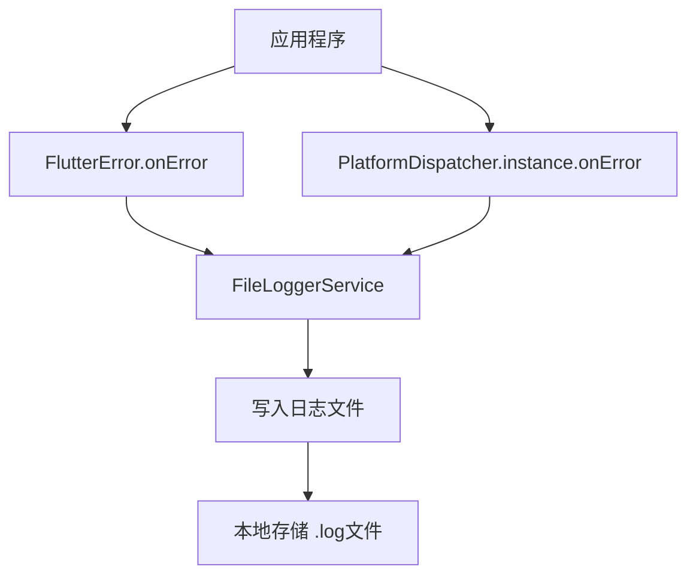
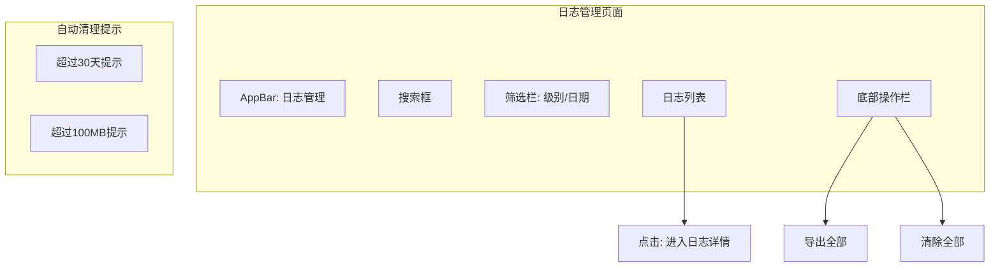

# 日志系统实现计划

## 1. 概述

实现一个完整的日志系统，用于捕获应用程序异常和错误，将日志信息持久化存储到手机本地文件中，并提供功能完善的日志管理页面。

## 2. 技术方案

### 2.1 错误捕获机制（Flutter 3.3+ 现代方式）



使用现代的错误捕获方式：
- `FlutterError.onError` - 捕获 Flutter 框架错误
- `PlatformDispatcher.instance.onError` - 捕获所有 Dart 异步错误（替代 runZonedGuarded）

### 2.2 日志存储结构

```
应用文档目录/
└── logs/
    ├── crash_2026-03-19_08-30-45.log
    ├── crash_2026-03-19_10-15-22.log
    └── error_2026-03-19_12-00-00.log
```

### 2.3 日志文件格式

每条日志记录包含以下信息：

```
================================================================================
[时间] 2026-03-19 08:30:45.123
[级别] ERROR
[类型] CRASH
================================================================================
[设备信息]
- 设备型号: Xiaomi 14
- 系统版本: Android 14
- CPU架构: arm64-v8a
- 应用版本: 1.0.0+1
- Dart版本: 3.8.0

[网络状态]
- 连接类型: WiFi
- 是否在线: true

[错误信息]
Null check operator used on a null value

[堆栈跟踪]
#0      main.<anonymous closure> (package:wanandroid_app/main.dart:15)
#1      _rootRun (dart:async/zone.dart:1390)
...

================================================================================
```

## 3. 模块设计

### 3.1 目录结构

```
lib/
├── core/
│   └── services/
│       └── logger/
│           ├── file_logger_service.dart    # 文件日志服务
│           ├── device_info_service.dart    # 设备信息收集
│           └── network_info_service.dart   # 网络状态收集
├── features/
│   └── logger/
│       ├── model/
│       │   ├── log_entry.dart              # 日志条目模型
│       │   └── log_level.dart              # 日志级别枚举
│       ├── provider/
│       │   └── logger_provider.dart        # 日志状态管理
│       └── view/
│           ├── log_management_page.dart    # 日志管理主页面
│           ├── log_list_tile.dart          # 日志列表项组件
│           └── log_detail_page.dart        # 日志详情页面
└── shared/
    └── utils/
        └── log_utils.dart                  # 扩展现有日志工具
```

### 3.2 核心类设计

#### 3.2.1 LogEntry 模型

```dart
@freezed
class LogEntry with _$LogEntry {
  const factory LogEntry({
    required String id,
    required DateTime timestamp,
    required LogLevel level,
    required String message,
    String? stackTrace,
    DeviceInfo? deviceInfo,
    NetworkInfo? networkInfo,
    String? filePath,
    int? fileSize,
  }) = _LogEntry;
  
  factory LogEntry.fromJson(Map<String, dynamic> json) =>
      _$LogEntryFromJson(json);
}
```

#### 3.2.2 FileLoggerService

```dart
class FileLoggerService {
  // 单例模式
  static final FileLoggerService _instance = FileLoggerService._internal();
  factory FileLoggerService() => _instance;
  
  // 核心方法
  Future<void> initialize();
  Future<void> logError(dynamic error, StackTrace? stackTrace, {LogLevel level});
  Future<List<LogEntry>> getLogEntries();
  Future<String> exportLog(LogEntry entry);
  Future<void> deleteLog(LogEntry entry);
  Future<void> deleteAllLogs();
  Future<int> getTotalLogSize();
  Future<void> checkAndPromptCleanup();
}
```

#### 3.2.3 DeviceInfoService

```dart
class DeviceInfoService {
  Future<DeviceInfo> collectDeviceInfo();
}

class DeviceInfo {
  final String deviceModel;
  final String systemName;
  final String systemVersion;
  final String cpuArch;
  final String appVersion;
  final String dartVersion;
}
```

#### 3.2.4 NetworkInfoService

```dart
class NetworkInfoService {
  Future<NetworkInfo> collectNetworkInfo();
}

class NetworkInfo {
  final String connectionType; // WiFi, Mobile, None
  final bool isOnline;
}
```

## 4. 页面设计

### 4.1 日志管理页面 (LogManagementPage)



#### 功能列表：
1. **搜索功能** - 按关键词搜索日志内容
2. **筛选功能** - 按日志级别（ERROR/WARNING/INFO）、日期范围筛选
3. **日志列表** - 显示日志条目，包含时间、级别、摘要
4. **批量操作** - 多选删除、导出选中项
5. **存储信息** - 显示总日志大小、文件数量
6. **自动清理提示** - 超过30天或100MB时显示提示

### 4.2 日志详情页面 (LogDetailPage)

#### 功能列表：
1. **完整日志信息展示** - 设备信息、网络状态、错误信息、堆栈跟踪
2. **复制功能** - 复制完整日志到剪贴板
3. **分享功能** - 通过系统分享功能分享日志文件
4. **删除功能** - 删除当前日志

## 5. 依赖包

需要在 `pubspec.yaml` 中添加以下依赖：

```yaml
dependencies:
  # 文件路径获取
  path_provider: ^2.1.5
  
  # 系统分享功能
  share_plus: ^10.1.4
  
  # 设备信息（可选，已有 Rust 实现）
  device_info_plus: ^11.2.0
  
  # 权限管理（Android写入存储）
  permission_handler: ^11.3.1
```

## 6. 实现步骤

### 第一阶段：核心服务层

1. **添加依赖包** - 在 pubspec.yaml 中添加必要依赖
2. **创建日志模型** - LogEntry、LogLevel、DeviceInfo、NetworkInfo
3. **实现 DeviceInfoService** - 收集设备信息（复用现有 Rust 实现）
4. **实现 NetworkInfoService** - 收集网络状态（复用 connectivity_plus）
5. **实现 FileLoggerService** - 核心日志文件读写服务

### 第二阶段：错误捕获集成

6. **修改 bootstrap.dart** - 使用现代错误捕获方式
   - 配置 `FlutterError.onError`
   - 配置 `PlatformDispatcher.instance.onError`
   - 集成 FileLoggerService

### 第三阶段：UI 实现

7. **创建日志管理页面** - LogManagementPage
8. **创建日志列表组件** - 支持搜索、筛选、多选
9. **创建日志详情页面** - LogDetailPage
10. **实现导出功能** - 复制到剪贴板、系统分享
11. **实现清除功能** - 单个/批量/全部删除

### 第四阶段：完善功能

12. **实现自动清理机制** - 检测并提示用户清理
13. **添加设置页面入口** - 在设置页面添加日志管理菜单项
14. **添加路由配置** - 配置日志管理页面路由

## 7. 自动清理机制

### 规则：
- **时间规则**：日志文件超过30天时提示用户
- **大小规则**：日志总大小超过100MB时提示用户
- **提示方式**：在日志管理页面顶部显示提示条

### 实现：
```dart
class LogCleanupChecker {
  static const int maxDays = 30;
  static const int maxSizeMB = 100;
  
  Future<CleanupRecommendation?> check() async {
    final entries = await FileLoggerService().getLogEntries();
    final totalSize = await FileLoggerService().getTotalLogSize();
    
    // 检查过期日志
    final oldEntries = entries.where(
      (e) => DateTime.now().difference(e.timestamp).inDays > maxDays
    ).toList();
    
    // 检查大小
    final sizeMB = totalSize / (1024 * 1024);
    
    if (oldEntries.isNotEmpty || sizeMB > maxSizeMB) {
      return CleanupRecommendation(
        oldEntriesCount: oldEntries.length,
        totalSizeMB: sizeMB,
      );
    }
    return null;
  }
}
```

## 8. 注意事项

1. **Android 权限**：Android 10+ 使用分区存储，应用数据目录不需要额外权限
2. **iOS 权限**：应用沙盒目录不需要额外权限
3. **性能考虑**：日志写入使用异步IO，避免阻塞主线程
4. **隐私考虑**：日志文件存储在应用私有目录，卸载应用时会一同删除
5. **日志脱敏**：避免记录敏感信息（密码、token等）

## 9. 测试要点

1. 验证各种错误类型的捕获（同步错误、异步错误、Flutter框架错误）
2. 验证日志文件的正确写入和读取
3. 验证设备信息和网络状态的正确收集
4. 验证日志管理页面的各项功能
5. 验证自动清理提示的触发条件
6. 验证日志导出和分享功能
