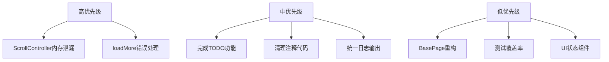

# WanAndroid Flutter Riverpod 项目优化计划

## 项目概述

这是一个基于 Flutter + Riverpod 的玩Android客户端应用，支持多平台（Android、iOS、Web、Linux、macOS、Windows）。项目使用了 flutter_rust_bridge 集成 Rust 代码。

## 发现的问题与优化建议

### 1. 代码架构优化

#### 1.1 BasePage 类功能缺失
**文件**: [`lib/shared/widget/base_page.dart`](lib/shared/widget/base_page.dart)

**问题**: `BasePage` 抽象类几乎没有实际功能，只是一个空的 `ConsumerWidget` 包装。

**建议**:
- 添加通用页面功能，如统一的错误处理、加载状态、空状态
- 或者直接移除，使用 `ConsumerWidget` 替代

```dart
// 建议的 BasePage 实现
abstract class BasePage extends ConsumerWidget {
  const BasePage({super.key});
  
  Widget buildContent(BuildContext context, WidgetRef ref);
  
  @override
  Widget build(BuildContext context, WidgetRef ref) {
    return GestureDetector(
      onTap: () => FocusScope.of(context).unfocus(),
      child: buildContent(context, ref),
    );
  }
}
```

#### 1.2 未完成的功能页面
**文件**: 
- [`lib/features/sign_in/view.dart`](lib/features/sign_in/view.dart)
- [`lib/features/sign_up/view.dart`](lib/features/sign_up/view.dart)
- [`lib/features/setting/view.dart`](lib/features/setting/view.dart)

**问题**: 这些页面只是占位符，功能未实现。

**建议**: 完成登录、注册、设置页面的完整实现。

#### 1.3 未使用的泛型 Provider
**文件**: [`lib/model/pagination_data_state_provider.dart`](lib/model/pagination_data_state_provider.dart)

**问题**: `PaginationDataState<T>` provider 定义了但未被使用。

**建议**: 
- 如果计划使用，则在分页列表中应用
- 如果不使用，则移除以减少代码体积

---

### 2. 网络层安全与错误处理优化

#### 2.1 重复的 HttpOverrides 定义
**问题**: `MyHttpOverrides` 在 `bootstrap.dart` 中定义，但 `http_client.dart` 中也有类似的证书绕过逻辑。

**建议**: 统一网络配置，移除重复代码。

#### 2.3 错误处理不完善
**文件**: [`lib/core/net/http_client.dart:82-97`](lib/core/net/http_client.dart:82)

**问题**: 
- 错误码 `-2` 和 `999` 缺少明确的错误类型区分
- 没有网络连接检测
- 错误信息不够用户友好

**建议**:
- 创建自定义异常类型
- 添加网络状态检测（已有 `connectivity_plus` 依赖）
- 实现错误信息的国际化

---

### 3. 状态管理优化

#### 3.1 loadMore 错误处理
**文件**: [`lib/features/article/presentation/providers/articles_provider.dart:31-60`](lib/features/article/presentation/providers/articles_provider.dart:31)

**问题**: `loadMore` 方法中错误只是打印日志，用户无法感知加载失败。

```dart
// 当前代码
catch (e, s) {
  if (kDebugMode) {
    print('Failed to load more articles: $e $s');
  }
}
```

**建议**:
- 添加错误状态管理
- 显示错误提示给用户
- 支持重试机制

```dart
// 建议的实现
Future<void> loadMore() async {
  if (state.isLoading || state.value?.hasReachedMax == true) {
    return;
  }

  final currentState = state.value!;
  final nextPage = currentState.page + 1;

  state = AsyncValue.loading();
  
  final result = await AsyncValue.guard(() async {
    final newArticles = await ArticleRepositoryImpl(ref).getArticles(nextPage);
    return currentState.copyWith(
      articles: [...currentState.articles, ...newArticles],
      page: nextPage,
      hasReachedMax: newArticles.isEmpty,
    );
  });
  
  state = result;
}
```

---

### 4. 代码质量与清理

#### 4.1 大量注释代码
**文件**: [`lib/shared/theme/app_theme.dart`](lib/shared/theme/app_theme.dart)

**问题**: 文件中有大量被注释的代码（约100行），影响可读性。

**建议**: 移除不再需要的注释代码，使用版本控制系统管理历史代码。

#### 4.2 使用 print 而非 log
**文件**: 多个文件

**问题**: 使用 `print` 语句进行日志输出，在生产环境可能泄露信息。

**建议**: 
- 使用 `logging` 包（项目已依赖）
- 或使用 `debugPrint` 并在发布模式禁用

#### 4.3 TODO 注释未完成
**位置**:
- [`lib/features/navi/view.dart:89`](lib/features/navi/view.dart:89) - Open website
- [`lib/features/navi/view.dart:103`](lib/features/navi/view.dart:103) - Show category detail
- [`lib/features/question_and_answers/view.dart:83-95`](lib/features/question_and_answers/view.dart:83) - Navigate to question detail
- [`lib/features/profile/view.dart:178-210`](lib/features/profile/view.dart:178) - Navigate to menu item

**建议**: 完成 TODO 功能或创建 Issue 跟踪。

---

### 5. 性能优化

#### 5.1 GlobalKey 和 ScrollController 在 build 中创建
**文件**: [`lib/features/home/view.dart:19-23`](lib/features/home/view.dart:19)

**问题**: 
- `GlobalKey<SliverAnimatedListState>` 和 `ScrollController` 在 `build` 方法中创建
- 每次重建都会创建新实例，可能导致内存泄漏和动画问题

```dart
// 当前代码 - 问题！
Widget build(BuildContext context, WidgetRef ref) {
  final GlobalKey<SliverAnimatedListState> listKey = GlobalKey<SliverAnimatedListState>();
  final ScrollController scrollController = ScrollController();
  // ...
}
```

**建议**: 将页面改为 `ConsumerStatefulWidget`，在 state 中管理这些对象。

```dart
// 建议的实现
class HomePage extends ConsumerStatefulWidget {
  const HomePage({super.key});

  @override
  ConsumerState<HomePage> createState() => _HomePageState();
}

class _HomePageState extends ConsumerState<HomePage> {
  final GlobalKey<SliverAnimatedListState> _listKey = GlobalKey();
  final ScrollController _scrollController = ScrollController();

  @override
  void dispose() {
    _scrollController.dispose();
    super.dispose();
  }
  
  // ...
}
```

#### 5.2 图片缓存优化
**文件**: 使用 `cached_network_image`

**建议**: 
- 配置合适的缓存大小和过期时间
- 考虑添加图片占位符和错误图

---

### 6. UI/UX 完善

#### 6.1 缺少加载和错误状态 UI
**问题**: 多个页面缺少统一的加载状态和错误状态展示。

**建议**: 
- 创建通用的状态组件（LoadingWidget、ErrorWidget、EmptyWidget）
- 在 `BasePage` 中集成这些状态

#### 6.2 设置页面功能不完整
**文件**: [`lib/features/setting/view.dart`](lib/features/setting/view.dart)

**问题**: 设置页面只有一个列表项，功能不完整。

**建议**: 添加常见设置项：
- 主题切换（已有 `themeModeProvider`）
- 字体大小设置
- 缓存清理
- 关于页面
- 退出登录

---

### 7. 测试覆盖率提升

**当前状态**: 
- `test/widget_test.dart` 存在
- `integration_test/simple_test.dart` 存在

**建议**:
- 为 Repository 添加单元测试
- 为 Provider 添加状态测试
- 为关键业务逻辑添加集成测试

---

## 优化优先级



## 实施建议

1. **第一阶段**: 修复内存泄漏和错误处理
2. **第二阶段**: 完善核心功能（登录、注册、设置）
3. **第三阶段**: 代码清理和重构
4. **第四阶段**: 测试补充和性能优化

---

## 是否需要进一步讨论？

请确认以上优化计划是否符合您的预期，或者您希望重点关注某些特定方面？
