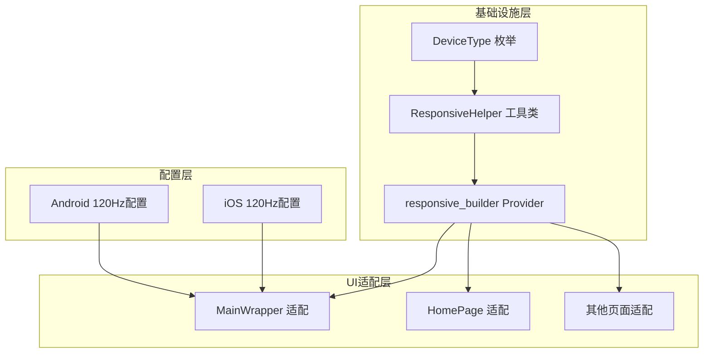
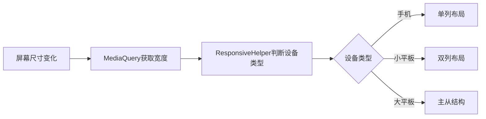

# 响应式布局与120Hz高刷新率适配计划

## 一、需求概述

### 1.1 目标
- 适配手机端和平板端，支持响应式布局
- 支持120Hz高刷新率屏幕
- 不改变现有库版本

### 1.2 断点设计
采用多断点系统：
- **手机**：< 600dp（单列布局）
- **小平板**：600dp - 840dp（双列布局）
- **大平板**：> 840dp（主从结构/多列布局）

---

## 二、技术架构

### 2.1 整体架构图



### 2.2 响应式布局流程



---

## 三、详细实施步骤

### 3.1 创建响应式布局基础设施

#### 3.1.1 创建设备类型枚举
**文件**: `lib/shared/utils/responsive/device_type.dart`

```dart
enum DeviceType {
  mobile,      // < 600dp
  smallTablet, // 600dp - 840dp
  largeTablet, // > 840dp
}
```

#### 3.1.2 创建响应式工具类
**文件**: `lib/shared/utils/responsive/responsive_helper.dart`

功能：
- 根据屏幕宽度判断设备类型
- 提供断点常量
- 提供便捷的构建方法

#### 3.1.3 创建响应式Builder组件
**文件**: `lib/shared/widgets/responsive/responsive_builder.dart`

功能：
- 监听屏幕尺寸变化
- 根据设备类型返回不同布局

---

### 3.2 配置120Hz高刷新率支持

#### 3.2.1 Android配置
**文件**: `android/app/src/main/AndroidManifest.xml`

在 `<application>` 标签内添加：
```xml
<meta-data
    android:name="android.view.Window.enableHighRefreshRate"
    android:value="true" />
```

#### 3.2.2 iOS配置
**文件**: `ios/Runner/Info.plist`

添加：
```xml
<key>CADisableMinimumFrameDurationOnPhone</key>
<true/>
<key>PreferredFrameRateRange</key>
<string>120</string>
```

---

### 3.3 适配MainWrapper主框架布局

**文件**: `lib/features/main_wrapper/view.dart`

#### 布局策略：
| 设备类型 | 导航方式 | 布局结构 |
|---------|---------|---------|
| 手机 | BottomNavigationBar | 底部导航栏 |
| 小平板 | NavigationRail | 左侧垂直导航栏 |
| 大平板 | NavigationRail + 扩展 | 左侧扩展导航栏 |

#### 实现示意：
```dart
// 手机：底部导航栏
// 小平板/大平板：左侧NavigationRail
```

---

### 3.4 适配HomePage首页布局

**文件**: `lib/features/home/view.dart`

#### 布局策略：
| 设备类型 | 布局结构 |
|---------|---------|
| 手机 | 单列列表 |
| 小平板 | 双列网格 |
| 大平板 | 主从结构（左侧列表 + 右侧详情） |

---

### 3.5 适配其他页面

#### 3.5.1 问答页面 (`lib/features/question_and_answers/view.dart`)
- 手机：单列列表
- 平板：双列/多列网格

#### 3.5.2 导航页面 (`lib/features/navi/view.dart`)
- 手机：列表展示
- 平板：网格展示

#### 3.5.3 个人中心 (`lib/features/profile/view.dart`)
- 手机：垂直布局
- 平板：水平布局或卡片式布局

---

## 四、文件变更清单

### 4.1 新增文件
| 文件路径 | 说明 |
|---------|------|
| `lib/shared/utils/responsive/device_type.dart` | 设备类型枚举 |
| `lib/shared/utils/responsive/responsive_helper.dart` | 响应式工具类 |
| `lib/shared/widgets/responsive/responsive_builder.dart` | 响应式Builder组件 |

### 4.2 修改文件
| 文件路径 | 修改内容 |
|---------|---------|
| `android/app/src/main/AndroidManifest.xml` | 添加120Hz配置 |
| `ios/Runner/Info.plist` | 添加120Hz配置 |
| `lib/features/main_wrapper/view.dart` | 响应式导航适配 |
| `lib/features/home/view.dart` | 响应式列表布局 |
| `lib/features/question_and_answers/view.dart` | 响应式布局 |
| `lib/features/navi/view.dart` | 响应式布局 |
| `lib/features/profile/view.dart` | 响应式布局 |

---

## 五、依赖说明

### 5.1 现有依赖（无需修改版本）
- `flutter_screenutil: ^5.9.3` - 继续用于尺寸适配
- `flutter_riverpod: ^3.0.3` - 用于状态管理

### 5.2 无需新增依赖
所有响应式功能通过Flutter原生`MediaQuery`和自定义工具类实现。

---

## 六、注意事项

1. **保持向后兼容**：所有修改需确保在手机端保持现有用户体验
2. **性能优化**：响应式布局切换时避免不必要的重建
3. **测试覆盖**：需要在多种屏幕尺寸下进行测试
4. **动画流畅**：利用120Hz刷新率优化动画体验

---

## 七、实施顺序

1. ✅ 创建响应式布局基础设施（DeviceType、ResponsiveHelper、ResponsiveBuilder）
2. ✅ 配置120Hz高刷新率（Android + iOS）
3. ✅ 适配MainWrapper主框架
4. ✅ 适配HomePage首页
5. ✅ 适配其他页面
6. ✅ 测试验证
